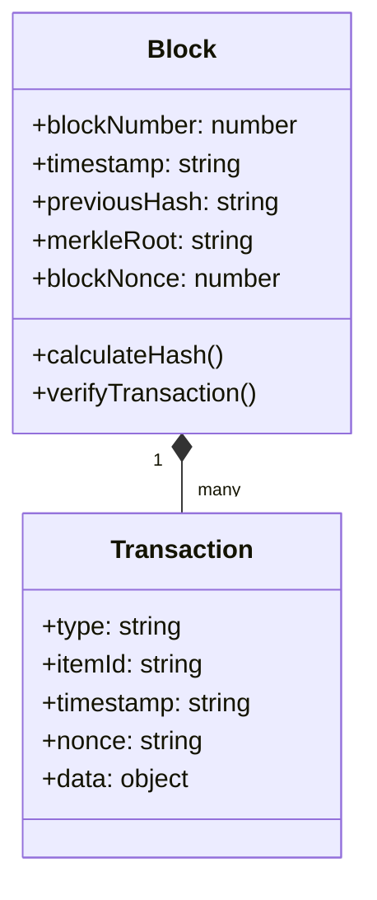
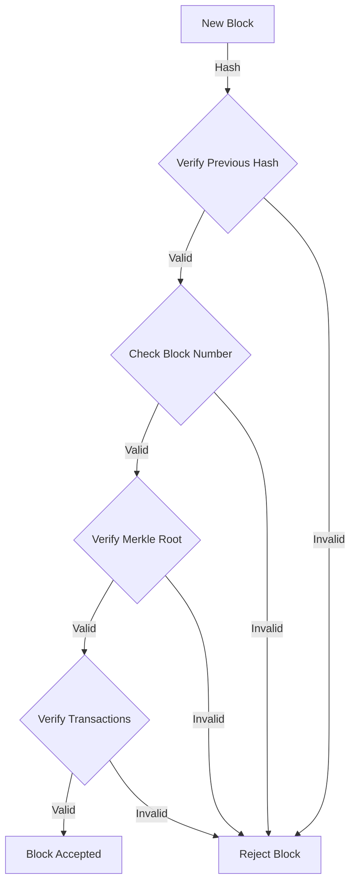
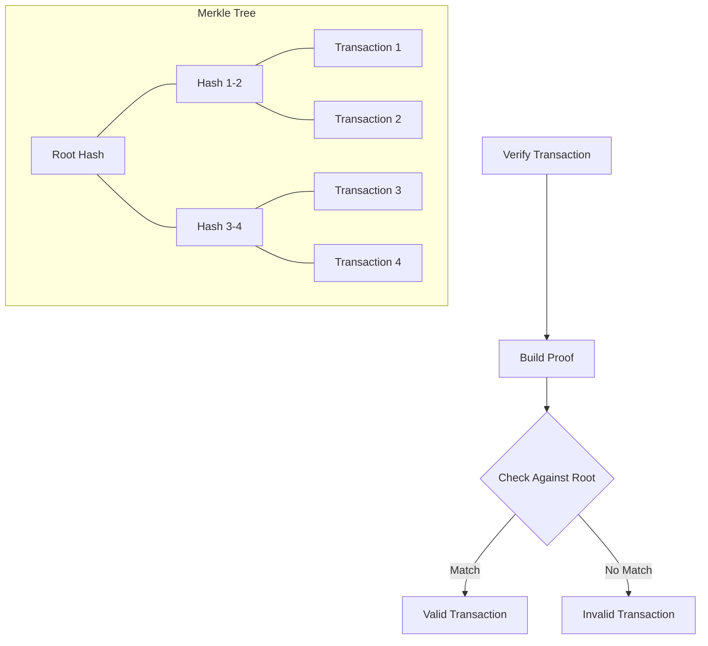
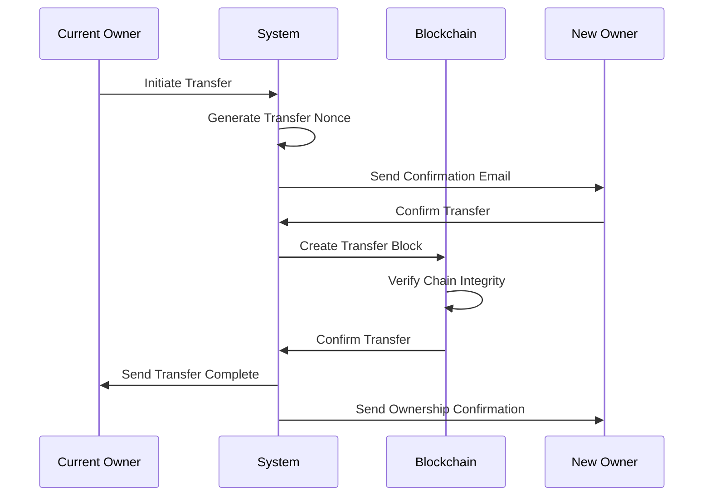

# verify.supply.tf

A blockchain-based physical asset verification and ownership tracking system built for SUPPLY: THE FUTURE apparel.

<div align="center">

[](https://www.typescriptlang.org/)
[](https://nextjs.org/)
[](https://www.postgresql.org/)
[](https://blockchain.com)
[](https://www.gnu.org/licenses/agpl-3.0)

</div>

## Overview

verify.supply.tf is a robust blockchain-based verification system designed to track and verify the authenticity and ownership of physical products. It creates an immutable digital record for each item, enabling secure ownership transfers and authenticity verification through NFC integration.

## Features

| Feature                        | Description                                                         |
| ------------------------------ | ------------------------------------------------------------------- |
| 🔒 **Blockchain Verification** | Immutable history tracking using a custom blockchain implementation |
| 👤 **Ownership Management**    | Secure transfer system with email verification                      |
| 🏷️ **NFC Integration**         | Physical-digital product linkage through NFC tags                   |
| 📱 **Mobile-First Design**     | Responsive interface optimized for mobile verification              |
| 🔍 **Audit Trail**             | Complete historical record of ownership transfers                   |
| 🛡️ **Tamper Protection**       | Cryptographic verification of product authenticity                  |

## Blockchain Architecture

### Block Structure



### Chain Verification Flow



### Merkle Tree Implementation



### Ownership Transfer Process



## Technical Implementation

### Core Components

<table>
<tr>
<td width="50%">

#### 🔒 Security Features

- **Nonce Verification**  
  64-character hex nonce prevents replay attacks
- **Timestamp Normalization**  
  Millisecond precision for reliable hashing
- **Merkle Tree Proofs**  
  Efficient transaction verification system
- **Chain Integrity**  
  Continuous block link verification
- **Data Immutability**  
  Cryptographic protection of records

</td>
<td width="50%">

#### 🏗️ Data Structures

```typescript
// Block Structure
interface BlockData {
  blockNumber: number;
  timestamp: string;
  previousHash: string;
  merkleRoot: string;
  blockNonce: number;
}

// Transaction Record
interface TransactionData {
  type: "create" | "transfer";
  itemId: string;
  timestamp: string;
  nonce: string;
  data: {
    from?: {
      name: string;
      email: string;
    };
    to: {
      name: string;
      email: string;
    };
    item: ItemDetails;
  };
}
```

</td>
</tr>
</table>

## Setup and Installation

### Prerequisites

- Node.js 18+
- PostgreSQL 15+
- pnpm (recommended)

### Quick Start

1. Clone and install dependencies:

```bash
git clone https://github.com/jiaweing/verify.supply.tf.git
cd verify.supply.tf
pnpm install
```

2. Configure environment:

```bash
cp .env.example .env
# Edit .env with your settings
```

3. Initialize database:

```bash
pnpm db:push
pnpm db:seed
```

4. Start development server:

```bash
pnpm dev
```

## License

This project is licensed under the GNU Affero General Public License v3.0 (AGPLv3).

See the [LICENSE](LICENSE) file for details.

---

<div align="center">

Built with ❤️ for <a href="https://supply.tf">SUPPLY: THE FUTURE</a>

</div>
