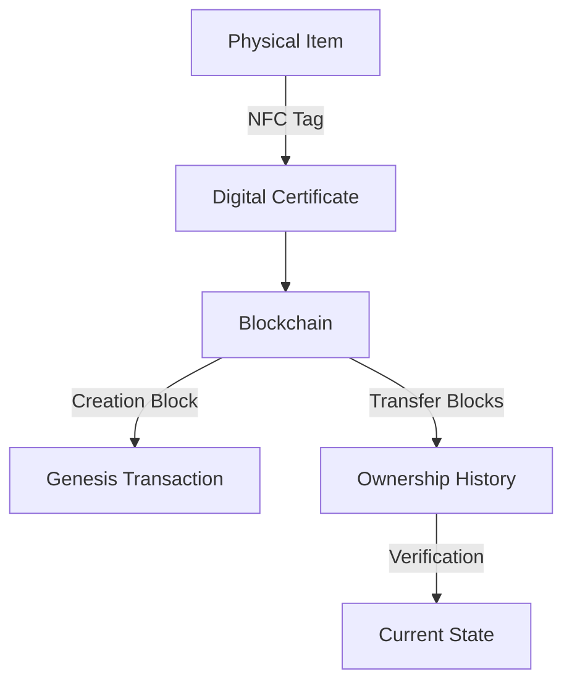
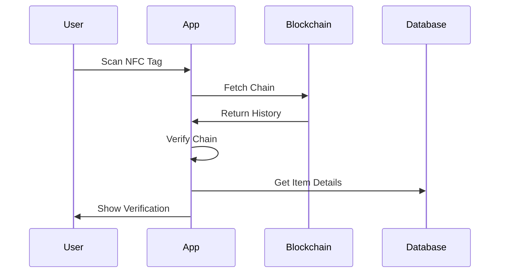

<div align="center">

# 🔐 verify.supply.tf

A blockchain-based verification system for tracking and verifying product authenticity and ownership.

Used in <a href="https://supply.tf">SUPPLY: THE FUTURE</a> apparel.

[](https://www.typescriptlang.org/)
[](https://nextjs.org/)
[](https://www.postgresql.org/)
[](https://blockchain.com)
[](https://www.gnu.org/licenses/agpl-3.0)

</div>

---

## 🌟 Features

<div align="center">

| Feature                        | Description                                 |
| ------------------------------ | ------------------------------------------- |
| 🔒 **Blockchain Verification** | Immutable history tracking for each item    |
| 👤 **Ownership Tracking**      | Complete chain of custody through transfers |
| 🛡️ **Tamper Detection**        | Identifies unauthorized modifications       |
| 📱 **NFC Integration**         | Physical-digital item linkage               |

</div>

## 🏗️ System Architecture



### 🔗 Blockchain Implementation

<details>
<summary>Click to expand</summary>

#### 📦 Blocks

- Single transaction per block
- Cryptographic hash chaining
- Merkle tree verification

#### 📝 Transactions

- Creation records
- Transfer records
- Hashed data storage

#### ✅ Verification

- Chain integrity checks
- Transaction validation
- State verification

</details>

## 🚀 Quick Start

### Prerequisites

- Node.js 18+
- PostgreSQL 15+
- pnpm (recommended)

### 🔧 Setup

1. **Clone & Install**

```bash
git clone https://github.com/jiaweing/verify.supply.tf.git
cd verify.supply.tf
pnpm install
```

2. **Configure Environment**

```bash
cp .env.example .env
# Edit .env with your settings
```

3. **Initialize Database**

```bash
pnpm db:push

# seed initial admin user and key
pnpm db:seed
```

4. **Start Development**

```bash
pnpm dev
```

## 🔍 Verification Flow



## 🔐 Security Features

| Feature                     | Description                              |
| --------------------------- | ---------------------------------------- |
| 🔗 **Blockchain Integrity** | Every change recorded in immutable chain |
| 📧 **Email Verification**   | Two-factor transfer confirmation         |
| ⏱️ **Time Limits**          | Expiring transfer requests               |
| 🔒 **Encryption**           | Secure item data storage                 |
| 📱 **NFC Authentication**   | Physical verification link               |

## 📚 API Documentation

### Item Verification

```typescript
GET /api/items/:id         // Get item details
POST /api/items/:id/verify // Verify authenticity
GET /api/items/:id/chain   // Get blockchain history
```

### Ownership Transfer

```typescript
POST /api/items/:id/transfer  // Start transfer
PUT /api/items/:id/transfer   // Confirm transfer
```

## 🧪 Testing

```bash
# Run unit tests
pnpm test

# Run E2E tests
pnpm test:e2e
```

## 🚀 Deployment

### Using Docker

```bash
# Build and run containers
docker-compose up -d
```

### Manual Deployment

```bash
pnpm build
pnpm start
```

## 🤝 Contributing

1. Fork repository
2. Create feature branch
3. Commit changes
4. Push to branch
5. Open pull request

## 📄 License

This project is licensed under the GNU Affero General Public License v3.0 (AGPLv3).

### Key Points:

- ✅ Freedom to use, modify, and distribute
- ✅ Source code must be made available when the software is distributed
- ✅ Network use counts as distribution
- ✅ Changes must be shared under the same license
- ✅ Modifications must state significant changes made

See the [LICENSE](LICENSE) file for the full text of the AGPLv3 license.

---

<div align="center">

Built with ❤️ by <a href="https://supply.tf">SUPPLY: THE FUTURE</a>

</div>
